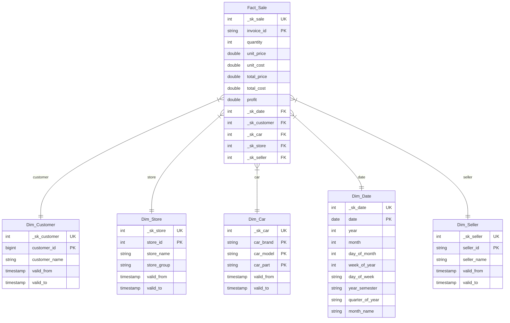

.png)

     [](LICENSE)

# 📊 Projeto de engenharia de dados Databricks

---
## Resumo
Este repositório contém a implementação de uma pipeline de dados construída utilizando o Databricks. O projeto foi desenvolvido com foco em aprendizado prático, explorando conceitos de engenharia de dados e boas práticas na construção de pipelines.

A solução utiliza notebooks no formato `.ipynb`, padrão da plataforma Databricks, e segue uma abordagem simples e direta, adequada para fins educacionais e de portfólio.

---
## ⚙️ A pipeline
O projeto foi desenvolvido utilizando a Arquitetura **_Medallion_**, amplamente recomendada para o processamento de dados no **`Databricks`**.

A pipeline é organizada em 3 camadas principais:
- Bronze
- Silver
- Gold

---

### Estrutura do projeto
```bash
projeto/
├── 000.environment_prepare.ipynb
│
├── 001.bronze/
│   └── 001.sales_bronze.ipynb
│
├── 002.silver/
│   ├── 001.sales_silver.ipynb
│   └── 000.production/
│       └── 001.sales_silver_prod.ipynb
│
├── 003.gold/
│   ├── 001.star_schema/
│   │   ├── 000.production
│   │   │   ├── 001.dim_car_gold_prod.ipynb
│   │   │   ├── 002.dim_customer_gold_prod.ipynb
│   │   │   ├── 003.dim_store_gold_prod.ipynb
│   │   │   ├── 004.dim_seller_gold_prod.ipynb
│   │   │   └── 005.fact_sale_gold_prod.ipynb
│   │   │
│   │   ├── 001.dim_date_gold.ipynb
│   │   ├── 002.dim_customer_gold.ipynb
│   │   ├── 003.dim_car_gold.ipynb
│   │   ├── 004.dim_store_gold.ipynb
│   │   ├── 005.dim_seller_gold.ipynb
│   │   └── 006.dim_fact_sale_gold.ipynb
│   │
│   └── 002.data_mart/
│       ├── 000.production
│       │   ├── 001.vw_sales_performance_by_store_prod.ipynb
│       │   ├── 002.vw_sales_performance_by_seller_prod.ipynb
│       │   ├── 003.vw_sales_performance_by_store_seller_prod.ipynb
│       │   └── 004.vw_sales_performance_by_time_prod.ipynb
│       │
│       ├── 001.vw_sales_performance_by_store.ipynb
│       ├── 002.vw_sales_performance_by_seller.ipynb
│       ├── 003.vw_sales_performance_by_store_seller.ipynb
│       └── 004.vw_sales_performance_by_time.ipynb
│
├── .gitignore
├── LICENSE
└── README.md
```

---

### 🥉 Bronze Layer
A camada Bronze é responsável pela ingestão dos dados brutos.  
Neste projeto, foi realizada a ingestão de arquivos `.csv` provenientes de uma Landing Zone, com conversão para tabelas no formato `Delta`.

Foram adicionadas colunas de auditoria, como:

- `ingestion_timestamp`
- `source_file`

A ingestão foi realizada utilizando **`PySpark`**, devido à sua flexibilidade e facilidade de manipulação.

#### Execução
O notebook [`001.sales_bronze.ipynb`](./001.bronze/001.sales_bronze.ipynb) é responsável pela execução da camada bronze. O código foi otimizado para o uso dos Volumes do **`Databricks`**. 

Ao executar o notebook, é necessário fazer a ingestão dos arquivos no Volume `sales_resources` no diretório `origin`. A criação do Volume e das pastas necessárias estão no notebook [`000.environment_prepare`](./000.environment_prepare.ipynb).

---

### 🥈 Silver Layer
A camada Silver é responsável pelo tratamento dos dados, incluindo:

- Limpeza  
- Deduplicação  
- Padronização  
- Upsert  

Foi criada uma versão do notebook voltada para produção, localizada em:

[`000.production`](./002.silver/000.production/)

Essa estrutura permite integração com o sistema de jobs do Databricks.

> [!Important]
> O tratamento da camada silver é específico a bases de dados com o mesmo **`schema`** da base de dados de referência. Se desejar alterar a base de dados altere os códigos de tratamento, pois pode haver erro ao executar com uma base de dados de **`schema`** diferente.

Ressalta-se que a preferência pelo tipo de tratamento de strings foi acertado com o cliente. Ademais, o tratamento de valores nulos e com quantidades nulas ou iguais a zero também foi tratado com o cliente, ele optou pela escolha de manter quantidades iguais a zero para armazenamento dos dados, mas retirou dos cálculos.

#### Execução
O notebook [`001.sales_silver.ipynb`](./002.silver/001.sales_silver.ipynb) é responsável pela primeira execução apenas e para mudanças futuras no tratamento dos dados. 

Para execuções automatizadas é necessário executar o notebook presente na pasta de produção: [`001.sales_silver_prod.ipynb`](./002.silver/000.production/001.sales_silver_prod.ipynb), após a primeira execução.

---

### 🥇 Gold Layer
A camada gold foi dividida em duas partes principais:

- Star Schema
- Data Mart

#### ⭐ Star Schema
Essa etapa envolve a montagem da modelagem de Data Warehouse Star Schema, que facilita o processamento na análise de dados, devido a sua leveza e relacionamento de informações, facilitando a criação de outras tabelas analíticas futuramente.

A estrutura do Star Schema foi feito da seguinte forma:


A escolha do Star Schema é devido a facilidade de criar outras tabelas relacionadas futuramente e, caso necessário, criar lógicas diretamente no BI. Além de facilitar o rastreio, organização, monitoramento e atualização das informações, sendo escolhido o tipo SCD 2 para as dimensões.

#### 🏪 Data Mart
Essa etapa foi feita para análise diante do pedido simulado dos clientes para o projeto. O pedido de análise envolveu os seguintes pontos:

- Como evoluíram nosso faturamento e resultados ao longo do tempo?
- Qual o desempenho das vendas por loja, grupo de lojas e vendedor?
- Quais períodos apresentam melhor e pior performance?
- Como está o comparativo entre anos?
- Quais unidades e grupos concentram maior volume de vendas?

Como conclusão do pedido foram feitas 4 views. O uso de views foi justificado pelo tamanho reduzido das tabelas, não impactando na performance, e por sua capacidade de atualização ao alterar as tabelas do Star Schema.

- Tabela de performance das lojas e grupos de lojas: [`vw_rank_by_store`](./003.gold/002.data_mart/001.vw_sales_performance_by_store.ipynb)
- Tabela de performance dos vendedores: [`vw_rank_by_seller`](./003.gold/002.data_mart/002.vw_sales_performance_by_seller.ipynb)
- Tabela de performance de lojas e vendedores: [`vw_rank_by_store_seller`](./003.gold/002.data_mart/003.vw_sales_performance_by_store_seller.ipynb)
- Tabela de performance por tempo: [`vw_rank_by_time`](./003.gold/002.data_mart/004.vw_sales_performance_by_time.ipynb)

Dessa forma, as views estão prontas para serem consumidas no BI.
> [!Note]
> Caso o BI seja feito no **`Databricks`**, o acesso às views é facilitada. Além disso, é possível o auxílio de Inteligência Artificial do **`Databricks`** o **`AgentAI`** para montagem de dashboards.

#### Execução
É necessário que a execução dos notebooks fora da pasta `.../000.production/` sejam executados primeiro e apenas uma vez, tanto no Star Schema quanto no Data Mart. Assim foi feito para criação das tabelas e views pela primeira vez.

Após, é necessário colocar os notebooks dentro da pasta `.../000.production/` no pipeline para execução do tratamento.

---
### 🧠 Decisões técnicas

- Uso de **Delta Lake** para suporte a *Upsert*, otimização, versionamento e integração ao ambiente **`Databricks`**.
- Organização de **notebooks de produção** para orquestração da pipeline.
- Utilização da arquitetura **_Medallion_**, facilitando manutenção, escalabilidade e organização.
- Utilização de **`PySpark`** para ingestão na bronze, devido sua alta capacidade de processamento e integração ao ambiente **`Databricks`**.
- Leitura de dados via **Volumes** do **`Databricks`**,garantindo maior governança dos dados através do **`Unity Catalog`**.
- Inclusão de colunas de auditoria para rastreabilidade e controle de ingestão.
- Aplicação de *Upsert* para evitar duplicidade e manter consistência de dados.
- Regras de tratamento definidas com base em requisitos simulados de negócio.
- Implementação de **Star Schema** para otimização consultas analíticas e melhor desempenho em ferramentas de BI.
- Utilização de **SCD Tipo 2** nas dimensões para preservação de histórico e rastreabilidade de alterações.
- Uso de **views** na camada Gold devido ao baixo volume de dados e priorizando a atualização de registros.
- Ranqueamento de registros com base em análises estatísticas: Classificações e *ranking*.
